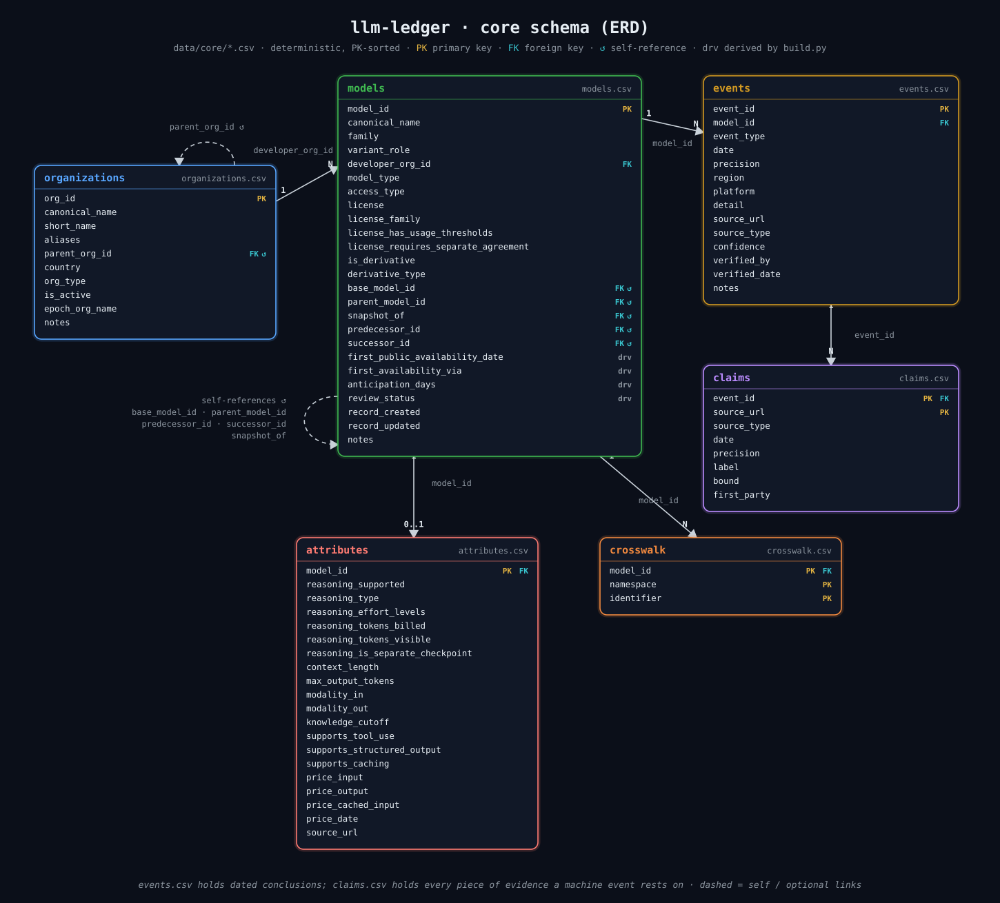

# llm-ledger

Ask "when was OpenAI's o3 released?" and you get four honest answers:

| event | date |
|---|---|
| announced | 2024-12-20 |
| o3-mini shipped | 2025-01-31 |
| in the API (`api_ga`) | 2025-04-16 |
| o3-pro shipped | 2025-06-10 |

Most catalogs collapse that into one "release date", and papers on the
same model end up using different days. This dataset keeps each moment
as its own row, with a date, how precise it is, the page it came from,
and how sure we are. Epoch AI tracks how big a model is; we track
**when** things happened. The two join on a shared key.

**Newest releases first:**
[`data/generated/models_latest.csv`](data/generated/models_latest.csv)
is a reading view of `models.csv`: the identifying columns, first public
availability date first, most recent releases at the top. It is rebuilt
on every update.

## How the data is shaped



Read it left to right. **Organizations** build **models**. A model does
not have a date; it has a life, and each moment of that life is a row in
**events**: announced, previewed, opened in the API, weights published,
retired. Every machine-dated event keeps its receipts in **claims**, one
row per source that had an opinion, so the verdict can be re-judged from
the evidence. **Crosswalk** maps a model's names across catalogs (the
same model is `gpt-4o` to OpenAI and `openai/gpt-4o` on OpenRouter), and
**attributes** is the spec sheet: context, modalities, prices.

`events.csv` is the real data. Everything under `data/generated/` is that
table re-arranged for convenience. Dates on `models.csv` such as
`first_public_availability_date` are computed from events; do not edit
them by hand.

| I want | Open this |
|---|---|
| newest releases at the top | [`data/generated/models_latest.csv`](data/generated/models_latest.csv) |
| one row per model, dates as columns | [`data/generated/llm_ledger_wide.csv`](data/generated/llm_ledger_wide.csv) |
| that plus Epoch scale columns | [`data/generated/llm_ledger_enriched.csv`](data/generated/llm_ledger_enriched.csv) |
| every dated fact with a source | [`data/core/events.csv`](data/core/events.csv) |
| every source behind a machine-dated fact | [`data/core/claims.csv`](data/core/claims.csv) |
| who made the model | [`data/core/models.csv`](data/core/models.csv), [`organizations.csv`](data/core/organizations.csv) |
| other names for the same model | [`data/core/crosswalk.csv`](data/core/crosswalk.csv) |
| context / prices / modalities | [`data/core/attributes.csv`](data/core/attributes.csv) |
| lab icons | [`assets/orgs/`](assets/orgs/) (`{org_id}.svg`) |
| how well each lab is covered | [`data/generated/coverage_report.md`](data/generated/coverage_report.md) |
| where catalogs disagree | [`data/generated/disagreement_report.md`](data/generated/disagreement_report.md) |
| how much "the date" moves | [`data/generated/sensitivity_report.md`](data/generated/sensitivity_report.md) |

Columns and allowed values: [`docs/schema.md`](docs/schema.md).

## How a date gets decided

A date enters the ledger one of two ways.

A curator opens the primary page, a vendor blog post or a deprecation
table, reads the date, and writes the row. `verified_by` records who:
a person's name, or `llm-ledger` / `llm-ledger-agent` when the
project's LLM-assisted curation did the reading. Scripts never touch
those rows. Today no row carries a person's name; the `curated` status
below says exactly that.

Or a script pulls it from a catalog: Hugging Face, models.dev,
OpenRouter, the vendors' own model lists, Azure and Bedrock lifecycle
tables, the Wayback Machine. Every catalog date becomes a claim, and one
policy (`pipeline/confidence.py`) turns claims into a verdict:

- one source alone is `inferred`;
- two independent sources that agree are `verified`, signed `llm-ledger`;
- stated dates that clash are `disputed`, with every value kept in `notes`.

Repo and registry creation timestamps can corroborate a date but never
set one on their own, because a Hugging Face repo is usually created
before the public launch (16 of 20 checkable cases; up to three weeks).
The full reasoning is in [`docs/methodology.md`](docs/methodology.md);
where the dates come from is in [`docs/sources.md`](docs/sources.md).

Operating rules that fall out of this:

- One event, one date, one URL. If the source only says "March 2024",
  we store `2024-03-01` and `precision=month`. We do not guess the day.
- Hugging Face `createdAt` of 2022-03-02 is a backfill, never a weights
  date. The Hub sweep keeps the top 40 repos per lab by downloads
  (`PER_ORG_CAP` in `pipeline/hf_census.py`); repos already in the ledger
  stay tracked when they fall out of the top 40.
- Names: exact match first. Fuzzy score >= 97 joins; 92-97 waits for a
  person; below 92 is no match.
- We looked for Chinese labs on purpose: their Hugging Face namespaces
  are swept, and ModelScope's public search is swept for the same labs
  so a twin repo can corroborate a Hub date. Vendor APIs skip if there
  is no key.
- A name on Wikipedia or a community timeline is a lead, not a fact. It
  sits in `data/staging/review_queue.csv` until a vendor page, Hub
  timestamp, or arXiv v1 backs it.
- A repo re-hosted under another lab's namespace is a lead, not a
  release. Packaging suffixes (FP8, BF16, INT4, an `-hf` conversion)
  never create a second model. API aliases (`-latest`, `deepseek-chat`)
  are not models. Image, video and music generators, embeddings and
  rerankers are out of scope by name.
- A models.dev date needs the vendor's own provider entry or a majority
  of resellers. When resellers disagree with no majority, no date is
  claimed and the case goes to the review queue.
- Dates read from timestamps (Hub `createdAt`, OpenRouter `created`,
  vendor registries) are UTC calendar dates; dates read from a page are
  as the page prints them. Expect one-day offsets for launches late in
  the US day or early in the Beijing day; the confidence policy allows
  two days for exactly this reason.

## Using it

```python
import pandas as pd

events = pd.read_csv("data/core/events.csv", parse_dates=["date"])
wide = pd.read_csv("data/generated/llm_ledger_wide.csv")

gap = (pd.to_datetime(wide["api_ga_date"]) -
       pd.to_datetime(wide["announced_date"])).dt.days.dropna()
print(gap.describe())
```

For research:

- **Filter first.** `models.review_status in {human_reviewed, curated,
  machine_corroborated}` and `events.confidence == "verified"` is the
  defensible sample; `first_availability_confidence` says how the
  headline date was reached. Only `human_reviewed` means a named person
  checked a page. The rest is a good lead list, not a fact list.
- **Pick the event that answers your question.** Adoption shocks:
  `api_ga` for developers, `weights_released` for the open ecosystem,
  `consumer_rollout` / `free_tier` for the public. `announced` is when
  people first heard. `platform_availability` (with `platform`) is when
  a cloud started serving it; `retired` with a `platform` is that host's
  shutdown, not the vendor's.
- **Know the biases.** Hub-only weights dates are `inferred` on purpose.
  Coverage is deepest for OpenAI and open-weight labs, thinnest for
  closed labs without an API listing. Every machine date's evidence is
  in `claims.csv`; every `disputed` row lists all values in `notes`.
- **Keep `source_url`.** It is the page a reader can open.

## How much is in it

<!-- stats:start -->
Exact counts as of the last rebuild: 1135 models from 41 organizations, 1874 dated events, backed by 2884 recorded claims. First availability runs from 2021-11-18 to 2026-09-10. 82% of the models are open-weight; Chinese labs make up 49% of those.

Read the counts honestly. 0 models are `human_reviewed` (a named person checked a primary page); 5% are `curated` (the project read a primary page such as a vendor blog or deprecation table); 50% are `machine_corroborated` (two independent sources agreed, or a platform reported its own listing); the remaining 45% are `unreviewed` catalog drafts. 50% of events are `verified`, and 30% of those are a platform's own listing timestamp; 0 were checked by a named person.
<!-- stats:end -->

Per-lab detail is in [`coverage_report.md`](data/generated/coverage_report.md),
rebuilt with the data. The paragraph above is written by `pipeline/build.py`
on every rebuild and checked by validation, so it cannot drift from the
tables.

## What is in and what is out

**In:** a named checkpoint from a lab (Qwen2.5-72B Instruct, Claude 3
Opus, Llama 3 70B).

**Out, unless the thing is famous on its own:**

- GGUF / GPTQ / AWQ: same model, packed for a laptop
- LoRA / adapters: a small patch on someone else's weights
- community merges: hobby blends, not a lab release

Count every GGUF and we would have fifty Qwen2.5-72Bs. We want one.

Also out: scores, parameter counts, training cost (use
[Epoch](https://epoch.ai/data/ai-models)), laws, usage stats.

This is a first cut, not everything. More models can go in. GGUFs
still will not.

## Rebuild

```bash
python -m venv .venv && .venv/bin/pip install -r requirements.txt
make all   # pull match reconcile census lifecycle build validate test
```

Generated files rebuild the same way every time. We do not commit raw
third-party dumps, only their URL and hash, so a fresh clone must run
`make pull` before the loaders; loaders refuse a snapshot older than
three days unless `LEDGER_ALLOW_STALE=1` is set. A failed puller fails
the run: nothing is committed on a day a source could not be read.

## More

- [`docs/schema.md`](docs/schema.md): tables and allowed values
- [`docs/sources.md`](docs/sources.md): where dates come from
- [`docs/methodology.md`](docs/methodology.md): inclusion and checks

## License

Code: [MIT](LICENSE-CODE). Data: [CC BY 4.0](LICENSE-DATA). You can
reuse the data; you must give credit (name, title, link, license).
That is the license. A paper citation is what we ask for on top.

Upstream: [Epoch AI](https://epoch.ai/data/ai-models) and
[NHLOCAL/AiTimeline](https://github.com/nhlocal/AiTimeline) (both CC BY
4.0). Other sites: we keep facts and URLs, not their dumps.

```bibtex
@misc{llmledger2026,
  author = {Ansari, Yasaman},
  title  = {llm-ledger: a provenance-tracked dataset of dated events in the
            lifecycle of large language models},
  year   = {2026},
  url    = {https://github.com/YasamanAnsari/llm-ledger}
}
```

[`CITATION.cff`](CITATION.cff) feeds GitHub's cite button.
